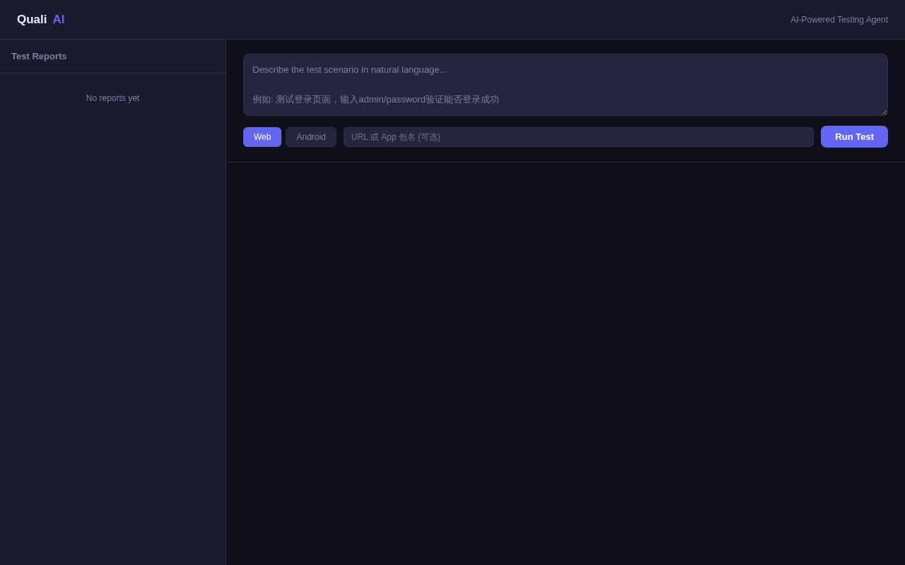
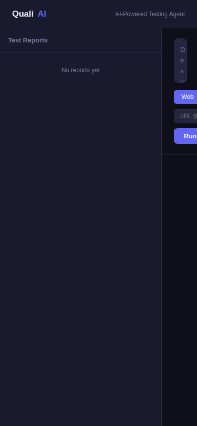

# 🧪 QualiAI — AI 驱动的智能测试代理

> 用自然语言描述测试场景，AI 自动规划、执行并生成测试报告。

```bash
$ quali run "测试登录页面：输入正确用户名和密码，验证登录成功"
QualiAI test starting

已生成 5 个测试步骤：
 [1] navigate: 打开登录页面
 [2] type: 输入用户名
 [3] type: 输入密码
 [4] click: 点击登录按钮
 [5] assert: 验证登录成功

执行中...
结果: 5/5 通过 (0 失败)
报告: reports/login_test.html
```

## 📸 界面预览

| Web 管理界面 | 手机端适配 |
|:---:|:---:|
|  |  |

## ✨ 功能特性

### 🎯 自然语言驱动
用大白话描述测试场景，AI 自动解析成可执行的测试步骤，零代码门槛。

### 🤖 AI 智能断言
截图 + DOM 综合分析，AI 自动判断每一步的通过/失败，无需手动写断言。

### 🔧 自愈选择器
页面 UI 变更时，AI 自动修复失效的 CSS 选择器，减少维护成本。

### 📱 多平台支持
- **Web 测试** — 基于 Playwright，支持 Chromium/Firefox/WebKit
- **Android 测试** — ADB 设备控制（点击/滑动/输入/截图）+ AI 视觉分析

### 📊 HTML 测试报告
每步截图、执行日志、AI 分析结果一目了然，支持在线查看。

### 🔄 场景录制与回放
保存测试场景，支持重复执行和批量运行。

## 🏗️ 系统架构

```
用户输入: quali run "测试登录页面"
    │
    ▼
Planner ── LLM 将自然语言分解为可执行步骤
    │
    ▼
Executor ── Playwright 执行步骤，每步截图
    │
    ▼
Asserter ── AI 分析截图+DOM，判断通过/失败
    │
    ▼
Reporter ── 生成 HTML 测试报告
```

## 📁 项目结构

```
quali-ai/
├── cli/main.py              CLI 入口
├── core/
│   ├── planner.py            AI 测试规划器
│   ├── executor.py           Playwright 执行器 + 自愈选择器
│   ├── asserter.py           AI 断言分析
│   ├── reporter.py           HTML 报告生成
│   ├── adb_controller.py     Android ADB 设备控制
│   ├── adb_executor.py       Android 测试执行器
│   └── vision_analyzer.py    AI 视觉分析（移动端）
├── scenarios/                测试场景文件
├── web/                      Web 管理界面（FastAPI）
└── reports/                  测试报告输出
```

## 🚀 快速开始

```bash
# 安装依赖
pip install -r requirements.txt
playwright install chromium

# 运行测试
quali run "搜索功能测试" --url https://example.com

# 回放已有场景
quali replay scenarios/demo/login.json

# Android 测试
quali android "登录测试" --app com.example.app
```

## 🗺️ 开发路线图

| 阶段 | 功能 | 状态 |
|------|------|:----:|
| Phase 1 | CLI 入口 + 测试规划器 + 执行器 + 报告生成 | ✅ |
| Phase 2 | AI 断言 + 自愈选择器 | ✅ |
| Phase 3 | Android ADB 支持 + AI 视觉分析 | ✅ |
| Phase 4 | Web 管理界面（FastAPI + 手机端适配） | ✅ |

## 🧩 技术栈

- **语言**: Python 3.10+
- **测试引擎**: Playwright
- **AI 模型**: DeepSeek API（可扩展）
- **Web 框架**: FastAPI + Uvicorn
- **移动端**: ADB + 视觉分析
- **报告**: 自渲染 HTML

## 📄 License

MIT
